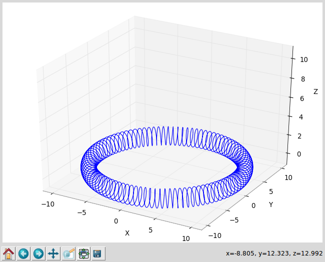
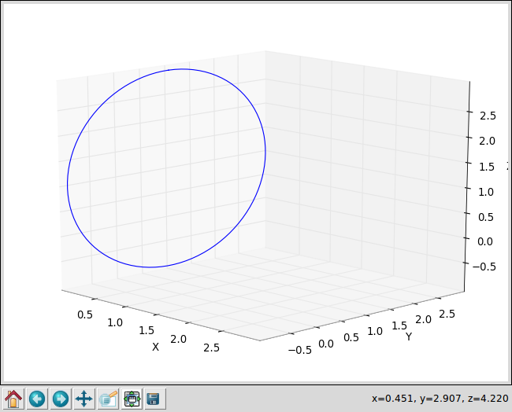
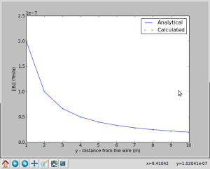
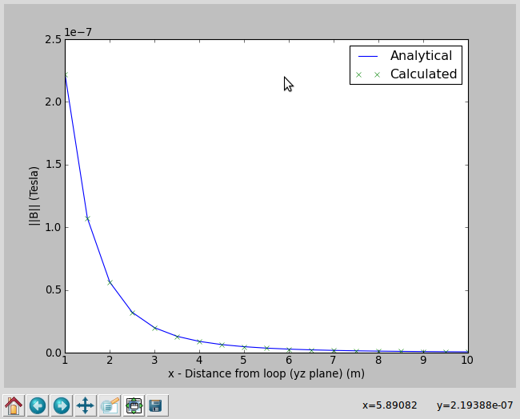

# BiotSavartSolver
A Simple Biot Savart Solver in Python

## Requirements:
- Python 2.7 or higher
- numpy
- scipy
- matplotlib

## Some theory
According to the Biot Savart Law, a field generated by an arbitrarily shaped wire described by the curve  carrying a complex current I at the point described by the displacement vector  in the vacuum is:

So an infinitesimal contribute by the infinitesimal piece of wire  will be:

Now we want to discretize this integral to make it computer-solvable, so we approximate  with :

where the displacement vector  now is simply calculated from the center coordinates of , which is a discretized segment of the original wire, short enough to apply these approximations.

Now we calculate  simply by adding together each contribute from each discretized piece of wire, that is:

Where the wire  is supposed to be discretized in N pieces. More advanced discretization techniques could be used, such as the Simpson’s rule, but for our purposes this kind of approach will suffice.

## The code:

Here a brief description of the source files (i.e. *.py files).

 - myShapes.py contains the Wire class, that implements a simple wire with some useful presets. This class has a property “coordz” that is a List formed by N+1 1×3 numpy.array representing the vertices of N segments of the wire, and a property I that is the complex current carried by the wire. You can define your own wires, although you can initialize it as a solenoid, loop, toroidal solenoid or segmented wire. Examples of these operations can be found in “Test_Shapes.py”
- Test_Shapes.py: examples on how to use the wire class and plotting of the results
- Discretizer.py: dicretizes a wire uniformly at a custom length. Examples on how to use this class can be found in “Test_Discretize.py”
- Test_Discretize.py  examples on how to use the Discretizer class
-  Biot_Savart.py: the core solver, it implements a solver as described above. Given a wire, the discretization length and the points on which perform the evaluation it returns the complex vector field B and can return also the absolute value of the norm of B.
-  Files named after “Test_Biot_Savart_*.py” will be showed in the next section

## Validation

I validated my solver confronting its results against theoretical results given in literature:

- Test_Biot_Savart_wire.py solves the B field given a long wire toward the z-axis on some points on the center of the wire toward the y-axis
- Test_Biot_Savart_solenoid.py solves the B field given a solenoid on some points in the center axis of it
- Test_Biot_Savart_toroidal_solenoid.py solves the B field on the center axis of a toroidal solenoid

Here some images of the wires:

Since quiver3D seems not to be implemented in matplotlib3D I haven’t added it yet in the scripts. It seems to be implemented in Mayavi but I had some difficulties importing it in Eclipse. So I simply plotted the absolute value of the norm of B against distance for the wire and the loop, and calculated the RMSE for every test. Now the 4 cases described;

For a straight long wire carrying a current I at a distance r from the wire the B field will have only one component on the azimuth i.e.:

So, running Test_Biot_Savart_loop.py we will see the plot Below:

and on the console we will see:

RMSE: 2.43426286502e-10

Analytical B (mean): 5.85793650794e-08 Tesla

Thus the Root Mean Squared Error is very small compared to the average B.

For a Circular loop of radius R carrying current I (loop in yz plane, at distance x along x-axis) we have:

So, running Test_Biot_Savart_loop.py we will see the plot Below:

and on the console we will see:

RMSE: 9.49980867342e-12

Analytical B (mean): 2.56313225429e-08 Tesla

Thus the Root Mean Squared Error is very small compared to the average B.

For a Solenoid with N turns and length l carrying current I (inside) B is constant and directed along the central axis:

and running Test_Biot_Savart_Solenoid.py we will see:

RMSE: 6.97877827573e-05

Analytical B: 0.000125663706144 Tesla

Thus the Root Mean Squared Error is very small compared to B.

For a Torus with N turns and radius r carrying current I (inside) B is constant and directed along the central axis:

and running Test_Biot_Savart_Toroidal_Solenoid.py we will see:

RMSE: 1.81013590516e-09

Analytical B: 2e-06 Tesla

Thus the Root Mean Squared Error is very small compared to B.
